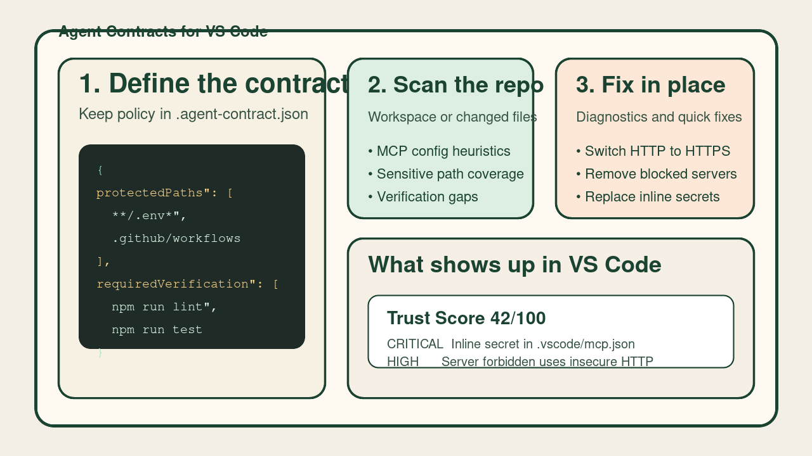
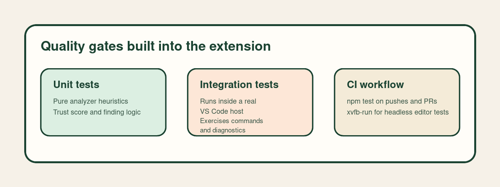

# Agent Contracts

`Agent Contracts` is a VS Code extension for repositories that use AI coding tools, MCP servers, and automation but still want explicit review boundaries.

[](https://github.com/padjon/vscode-agent-contracts/actions/workflows/ci.yml)

It keeps a small policy file in the repo and uses it to answer practical questions:

- which files should be treated as sensitive
- which checks should run before changes are trusted
- which MCP setups look risky or need review



## What it does

- creates a repo-local `.agent-contract.json`
- analyzes MCP config files in the workspace
- analyzes only changed files when you want a branch-focused review
- checks whether sensitive files are covered by protected path rules
- compares your contract with the verification scripts your repo already exposes
- can add missing verification commands to the contract
- can add current sensitive files to the contract as protected paths
- adds line-precise diagnostics for MCP findings when the file is open
- offers quick fixes for safe MCP cleanup cases
- generates a readable report inside VS Code
- shows findings and shortcuts in a dedicated Activity Bar view

## How it works

The extension scans the current workspace and builds findings from four sources.

### 1. Contract file

If `.agent-contract.json` is missing, Agent Contracts reports that the repository has no explicit trust policy yet.

### 2. Verification rules

The extension reads `package.json` and looks for common quality gates such as:

- `lint`
- `typecheck`
- `test`
- `build`

If those scripts exist but are not listed in `requiredVerification`, it reports the gap.

### 3. Sensitive paths

The extension searches for files that usually deserve extra review, such as:

- `.env*`
- `*.pem`
- `*.key`
- secret config files

If those files are not covered by `protectedPaths`, it reports them.

### 4. MCP risk

The extension scans workspace MCP configs and flags patterns such as:

- shell wrappers like `bash -c`
- package runners like `npx`, `pnpm`, or `docker`
- insecure `http://` MCP URLs
- inline secrets in environment variables
- MCP servers blocked by the contract but still configured

## Getting started

1. Open a repository in VS Code.
2. Run `Agent Contracts: Initialize Contract`.
3. Review the generated `.agent-contract.json`.
4. Run `Agent Contracts: Analyze Workspace`.
5. Open the Agent Contracts Activity Bar view or run `Agent Contracts: Open Report`.

There is also a built-in `Agent Contracts: How It Works` command if you want the short product guide inside VS Code.

If you are reviewing an active branch, run `Agent Contracts: Analyze Changed Files` instead of the full workspace scan.

## What the workflow feels like

1. Create or open `.agent-contract.json`.
2. Run a workspace scan to establish a baseline.
3. Use changed-file scans while reviewing a branch.
4. Fix MCP issues directly from diagnostics when a safe quick fix is available.
5. Keep the contract in version control so the repo explains its own trust boundaries.

## Example contract

The extension stores its policy in `.agent-contract.json`.

```json
{
  "protectedPaths": [
    "**/.env*",
    "**/*.pem",
    ".github/workflows/**"
  ],
  "requiredVerification": [
    "npm run lint",
    "npm run test"
  ],
  "blockedCommands": [
    "git push --force",
    "rm -rf /",
    "curl | sh"
  ],
  "blockedMcpServers": []
}
```

## Example findings

Examples of things the extension will report:

- `No agent contract file found`
- `Sensitive-looking files are not covered by protected paths`
- `Server github runs through a shell wrapper`
- `Server deployment uses insecure HTTP`
- `Common verification steps are not covered by the contract`

## Commands

- `Agent Contracts: Initialize Contract`
- `Agent Contracts: Analyze Workspace`
- `Agent Contracts: Analyze Changed Files`
- `Agent Contracts: Open Report`
- `Agent Contracts: How It Works`
- `Agent Contracts: Add Recommended Verification`
- `Agent Contracts: Protect Sensitive Paths`

## View

The Activity Bar view shows:

- current trust score
- whether the last scan covered the whole workspace or only changed files
- a shortcut to the report
- shortcuts for common contract updates
- top findings from the latest scan

## Diagnostics and autofixes

Findings tied to files are also surfaced as editor diagnostics.

The first autofix commands currently supported are:

- add inferred verification commands into `requiredVerification`
- add currently detected sensitive files into `protectedPaths`

For MCP config files, the current quick fixes cover:

- switching `http://` MCP URLs to `https://`
- removing MCP servers blocked by the contract
- replacing inline secret values with `${ENV_VAR}` style references

## Quality

The extension now includes:

- unit tests for analyzer heuristics
- extension-host integration tests running against a real VS Code instance
- a GitHub Actions workflow that runs `npm test` on pushes and pull requests



The trust score is only a prioritization signal. The detailed findings matter more than the number.

## Current scope

This version focuses on analysis and shared policy. It does not intercept agent actions or replace CI and code review.
